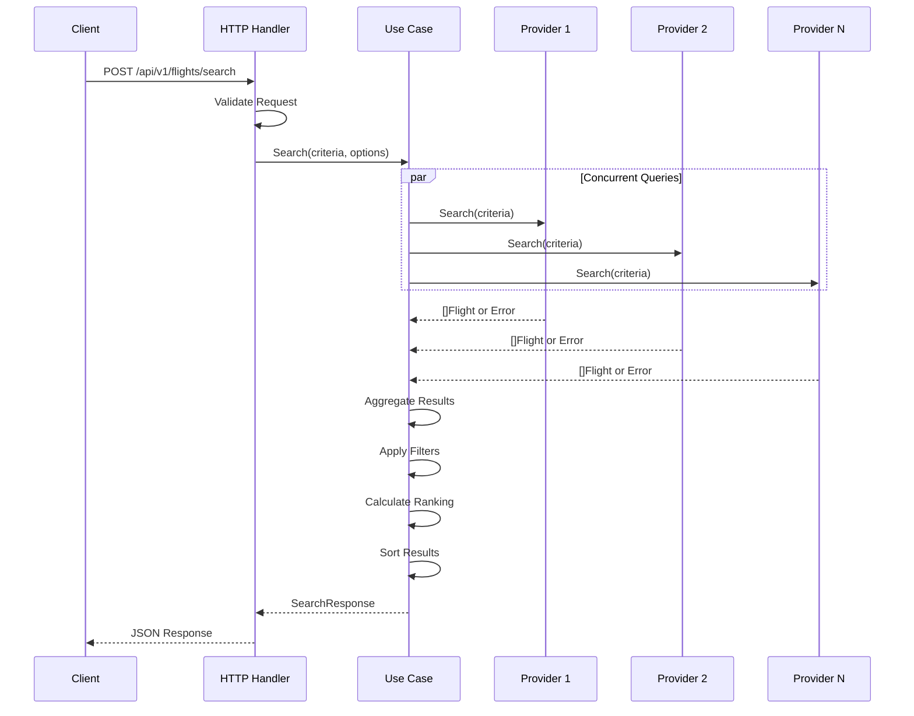

# Flight Search System - Architecture Documentation

This document provides a comprehensive overview of the Flight Search Aggregation System architecture.

## Table of Contents

1. [System Overview](#system-overview)
2. [Architecture Principles](#architecture-principles)
3. [Layer Architecture](#layer-architecture)
4. [Data Flow](#data-flow)
5. [Concurrency Model](#concurrency-model)
6. [Error Handling Strategy](#error-handling-strategy)
7. [Configuration Management](#configuration-management)
8. [Testing Strategy](#testing-strategy)

---

## System Overview

The Flight Search Aggregation System is a high-performance Go service that aggregates flight search results from multiple airline providers. It provides a unified API for searching flights across Garuda Indonesia, Lion Air, Batik Air, and AirAsia.

### Key Characteristics

- **Concurrent Provider Queries**: Uses scatter-gather pattern for parallel provider calls
- **Graceful Degradation**: Returns partial results when some providers fail
- **Configurable Timeouts**: Per-provider and global timeout management
- **Intelligent Ranking**: Weighted algorithm for "best value" flight recommendations
- **Flexible Filtering**: Multiple filter options (price, stops, airlines, time)

---

## Architecture Principles

The system follows **Clean Architecture** principles:

### Dependency Rule

Dependencies point inward. Inner layers know nothing about outer layers.

```
    ┌─────────────────────────────────────────────────────────┐
    │                   Frameworks & Drivers                   │
    │              (Echo HTTP, zerolog, config)               │
    │  ┌─────────────────────────────────────────────────┐   │
    │  │              Interface Adapters                  │   │
    │  │         (HTTP Handlers, Provider Adapters)       │   │
    │  │  ┌─────────────────────────────────────────┐   │   │
    │  │  │           Application Layer             │   │   │
    │  │  │    (Use Cases: Search, Filter, Rank)    │   │   │
    │  │  │  ┌───────────────────────────────┐    │   │   │
    │  │  │  │         Domain Layer          │    │   │   │
    │  │  │  │   (Entities, Interfaces)      │    │   │   │
    │  │  │  └───────────────────────────────┘    │   │   │
    │  │  └─────────────────────────────────────────┘   │   │
    │  └─────────────────────────────────────────────────┘   │
    └─────────────────────────────────────────────────────────┘
```

### Key Principles Applied

| Principle | Implementation |
|-----------|----------------|
| **Single Responsibility** | Each component has one reason to change |
| **Open/Closed** | New providers added without modifying use case |
| **Liskov Substitution** | All providers implement `FlightProvider` interface |
| **Interface Segregation** | Small, focused interfaces |
| **Dependency Inversion** | High-level modules depend on abstractions |

---

## Layer Architecture

### Domain Layer (`internal/domain/`)

The core business entities and interfaces. No external dependencies.

```go
// Core entities
type Flight struct { ... }
type SearchCriteria struct { ... }
type FilterOptions struct { ... }
type SearchResponse struct { ... }

// Core interface - implemented by provider adapters
type FlightProvider interface {
    Name() string
    Search(ctx context.Context, criteria SearchCriteria) ([]Flight, error)
}
```

**Files:**
- `flight.go` - Flight entity with airline, price, duration, etc.
- `search.go` - SearchCriteria with validation
- `filter.go` - FilterOptions and SortOption types
- `response.go` - SearchResponse with metadata
- `errors.go` - Domain-specific errors
- `provider.go` - FlightProvider interface and ProviderRegistry

### Use Case Layer (`internal/usecase/`)

Application business logic. Orchestrates the flow between domain and adapters.

```go
type FlightSearchUseCase interface {
    Search(ctx context.Context, criteria SearchCriteria, opts SearchOptions) (*SearchResponse, error)
}
```

**Responsibilities:**
- Scatter-gather pattern for concurrent provider queries
- Timeout management (global and per-provider)
- Result aggregation from multiple providers
- Filtering and sorting orchestration
- Ranking score calculation

**Files:**
- `flight_search.go` - Main search use case with scatter-gather
- `filter.go` - Apply filter logic
- `ranking.go` - Calculate ranking scores and sort results
- `options.go` - SearchOptions configuration

### Adapter Layer (`internal/adapter/`)

Interface adapters connecting domain to external systems.

#### HTTP Adapter (`internal/adapter/http/`)

Handles HTTP protocol concerns.

**Files:**
- `handler.go` - FlightHandler with SearchFlights endpoint
- `request.go` - Request DTOs and validation
- `response/` - Response builders and error formatting
- `middleware/` - RequestID, Logger, Recovery middleware
- `routes.go` - Route registration
- `converter.go` - DTO to domain conversion

#### Provider Adapters (`internal/adapter/provider/`)

Each airline provider has its own adapter:

```
provider/
├── garuda/     - Garuda Indonesia adapter
├── lionair/    - Lion Air adapter
├── batikair/   - Batik Air adapter
└── airasia/    - AirAsia adapter
```

Each adapter:
- Implements `FlightProvider` interface
- Normalizes provider-specific JSON to domain `Flight` entities
- Handles provider-specific date/time formats
- Maps airline codes and names

### Infrastructure Layer (`internal/infrastructure/`)

Cross-cutting concerns and utilities.

**Components:**
- `logger/` - Structured logging with zerolog
- `retry/` - Retry utilities for transient failures
- `timeutil/` - Time parsing and formatting helpers

### Configuration (`internal/config/`)

Environment-based configuration management.

- Loads from environment variables
- Supports `.env` files for local development
- Validates all configuration values
- Provides typed configuration structs

---

## Data Flow

### Request Processing Flow

```
┌─────────┐    ┌─────────┐    ┌───────────┐    ┌────────────────┐
│  Client │───▶│ Handler │───▶│  Use Case │───▶│   Providers    │
│         │    │         │    │           │    │  (concurrent)  │
└─────────┘    └────┬────┘    └─────┬─────┘    └───────┬────────┘
                    │               │                   │
                    │  Validate     │   Scatter         │
                    │  Request      │                   │
                    │               │◀──────────────────┘
                    │               │   Gather          
                    │               │                   
                    │               │   Filter & Rank   
                    │◀──────────────┘                   
                    │                                   
                    │  Format Response                  
                    ▼                                   
              ┌─────────┐                               
              │  JSON   │                               
              │ Response│                               
              └─────────┘                               
```

### Detailed Sequence



---

## Concurrency Model

### Scatter-Gather Pattern

The use case implements scatter-gather for parallel provider queries:

```go
func (uc *flightSearchUseCase) Search(ctx context.Context, criteria SearchCriteria, opts SearchOptions) (*SearchResponse, error) {
    // Create context with global timeout
    ctx, cancel := context.WithTimeout(ctx, uc.globalTimeout)
    defer cancel()

    // Buffered channel for results
    resultsChan := make(chan providerResult, len(uc.providers))

    // Scatter: Launch goroutines for each provider
    var wg sync.WaitGroup
    for _, provider := range uc.providers {
        wg.Add(1)
        go func(p FlightProvider) {
            defer wg.Done()
            uc.queryProvider(ctx, p, criteria, resultsChan)
        }(provider)
    }

    // Close channel when all goroutines complete
    go func() {
        wg.Wait()
        close(resultsChan)
    }()

    // Gather: Collect results
    var allFlights []Flight
    for result := range resultsChan {
        if result.Error == nil {
            allFlights = append(allFlights, result.Flights...)
        }
    }

    // Process and return
    return uc.processResults(allFlights, opts)
}
```

### Timeout Strategy

```
Global Timeout (5s)
├── Provider 1 Timeout (2s)
├── Provider 2 Timeout (2s)
├── Provider 3 Timeout (2s)
└── Provider 4 Timeout (2s)
```

- Each provider has its own timeout context
- Global timeout ensures bounded response time
- Partial results returned if some providers timeout
- Context cancellation propagates to all goroutines

### Thread Safety

- Mock providers use `sync.Mutex` for call count tracking
- Results channel is buffered to prevent goroutine blocking
- Context cancellation is checked before and after delays

---

## Error Handling Strategy

### Error Hierarchy

```
Domain Errors
├── ErrInvalidRequest      - 400 Bad Request
├── ErrAllProvidersFailed  - 503 Service Unavailable
├── ErrProviderTimeout     - Internal (aggregated)
└── ErrProviderUnavailable - Internal (aggregated)

Provider Errors (wrapped with context)
└── ProviderError
    ├── Provider name
    ├── Underlying error
    └── Retryable flag
```

### Error Mapping

| Domain Error | HTTP Status | User Message |
|--------------|-------------|--------------|
| `ErrInvalidRequest` | 400 | Validation details |
| `ErrAllProvidersFailed` | 503 | "All providers unavailable" |
| `context.DeadlineExceeded` | 504 | "Request timed out" |
| `context.Canceled` | 499 | "Request cancelled" |
| Other | 500 | "Unexpected error" |

### Graceful Degradation

```go
// Partial failure handling
if len(failedProviders) < len(allProviders) {
    // Return results from successful providers
    return &SearchResponse{
        Flights: aggregatedFlights,
        Metadata: SearchMetadata{
            ProvidersFailed: failedProviders,
        },
    }, nil
}

// Total failure
return nil, ErrAllProvidersFailed
```

---

## Configuration Management

### Configuration Structure

```go
type Config struct {
    Server   ServerConfig   // Port, timeouts
    Timeouts TimeoutConfig  // Search timeouts
    Logging  LoggingConfig  // Level, format
    App      AppConfig      // Environment
}
```

### Validation Rules

| Setting | Validation |
|---------|------------|
| `SERVER_PORT` | 1-65535 |
| `TIMEOUT_PER_PROVIDER` | Must be < `TIMEOUT_GLOBAL_SEARCH` |
| `LOG_LEVEL` | debug, info, warn, error |
| `LOG_FORMAT` | json, console |
| `APP_ENV` | development, staging, production |

### Loading Priority

1. Environment variables
2. `.env` file (if present)
3. Default values

---

## Testing Strategy

### Test Pyramid

```
        ┌─────────┐
        │   E2E   │  - Full HTTP tests with real server
       ─┼─────────┼─
      ┌─┴─────────┴─┐
      │ Integration │  - Handler + UseCase + Mocks
     ─┼─────────────┼─
    ┌─┴─────────────┴─┐
    │      Unit       │  - Individual functions
   ─┼─────────────────┼─
```

### Test Categories

| Level | Location | Description |
|-------|----------|-------------|
| Unit | `*_test.go` next to code | Pure function tests |
| Integration | `test/integration/` | Component interaction tests |
| Mocks | `test/mock/` | Configurable test doubles |
| Helpers | `test/testutil/` | Shared test utilities |

### Mock Strategy

```go
// Configurable mock provider
mock.NewProvider("garuda").
    WithFlights(sampleFlights).
    WithDelay(100 * time.Millisecond).
    WithError(someError)
```

### Coverage Targets

| Package | Target | Rationale |
|---------|--------|-----------|
| `domain` | 90%+ | Core business logic |
| `usecase` | 85%+ | Application logic |
| `adapter/provider` | 80%+ | Normalization logic |
| `adapter/http` | 75%+ | HTTP handling |

---

## Future Considerations

### Scalability

- Add caching layer (Redis) for frequent searches
- Implement circuit breakers for provider protection
- Add rate limiting middleware

### Observability

- Distributed tracing (OpenTelemetry)
- Metrics collection (Prometheus)
- Enhanced structured logging

### Features

- Return flight support
- Multi-city search
- Price alerts
- Booking integration
